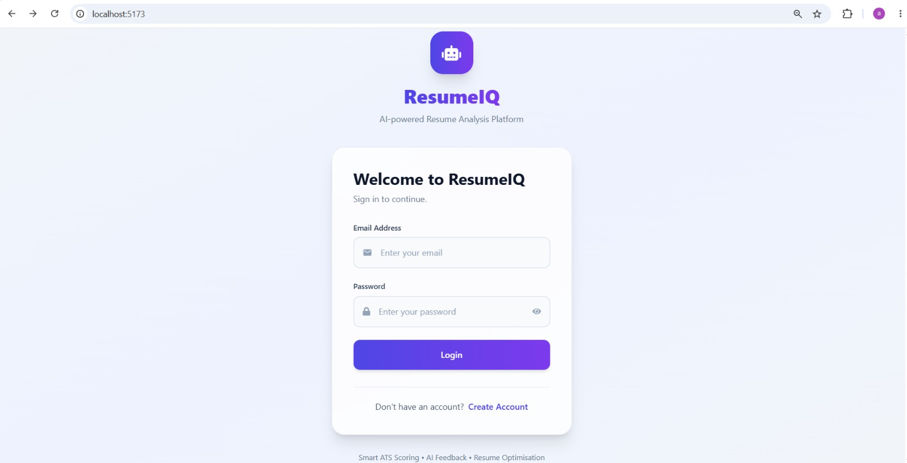
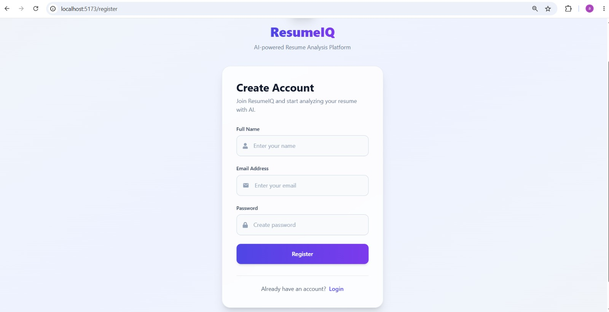
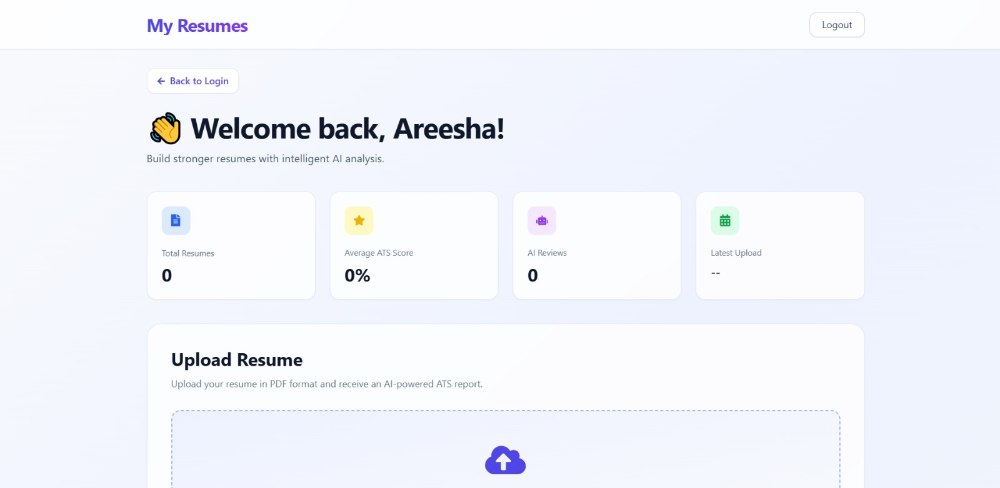
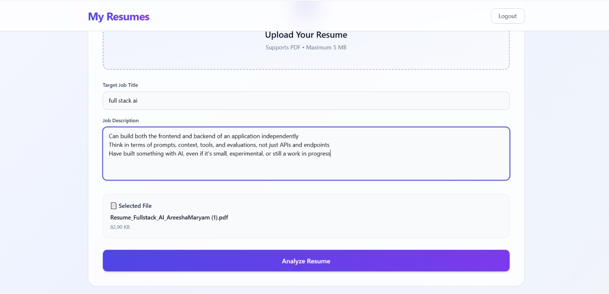
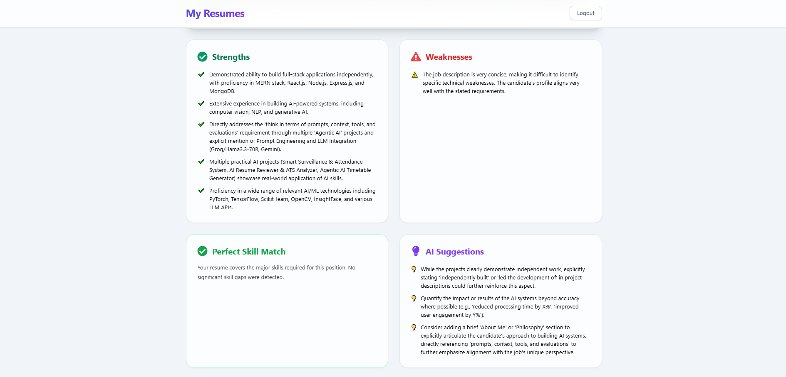
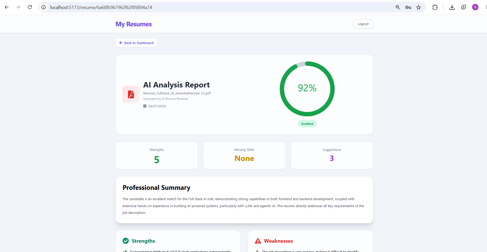

#  ResumeIQ – AI Resume Reviewer

ResumeIQ is a full-stack AI-powered Resume Analysis platform that helps users evaluate and improve their resumes using Google's Gemini API. Users can securely upload PDF resumes, compare them against a target job description, receive an ATS compatibility score, identify missing skills, and get AI-generated recommendations to improve their chances of passing Applicant Tracking Systems (ATS).

---

## 🚀 Features

- Secure User Authentication (JWT)
- Upload Resume in PDF Format
- AI Resume Analysis using Google Gemini API
- ATS Compatibility Score
- Job Title & Job Description Based Evaluation
- AI Suggestions for Resume Improvement
- Missing Skills Detection
- Resume Strengths & Weaknesses
- Resume History Dashboard
- Search & Sort Previous Resume Reviews
- Responsive Modern User Interface

---

# 🛠 Tech Stack

### Frontend

- React.js
- Vite
- Tailwind CSS
- React Router DOM
- Axios
- Framer Motion
- React Icons
- SweetAlert2

### Backend

- Node.js
- Express.js
- JWT Authentication
- Multer
- pdf-parse

### AI

- Google Gemini API

### Database

- MongoDB Atlas
- Mongoose

---

# 📁 Project Structure

```text
AI-RESUME-REVIEWER/
│
├── backend/
│   ├── src/
│   │   ├── config/
│   │   │   └── db.js
│   │   │
│   │   ├── controllers/
│   │   │   ├── authController.js
│   │   │   └── resumeController.js
│   │   │
│   │   ├── middleware/
│   │   │   ├── authMiddleware.js
│   │   │   └── upload.js
│   │   │
│   │   ├── models/
│   │   │   ├── User.js
│   │   │   └── Resume.js
│   │   │
│   │   ├── routes/
│   │   │   ├── authRoutes.js
│   │   │   └── resumeRoutes.js
│   │   │
│   │   ├── services/
│   │   │   └── geminiService.js
│   │   │
│   │   ├── utils/
│   │   │   ├── pdfParser.js
│   │   │   └── progressManager.js
│   │   │
│   │   └── server.js
│   │
│   ├── uploads/
│   ├── .env
│   ├── package.json
│   └── README.md
│
├── frontend/
│   ├── public/
│   │   └── vite.svg
│   │
│   ├── src/
│   │   ├── assets/
│   │   │   └── react.svg
│   │   │
│   │   ├── components/
│   │   │   ├── Loader.jsx
│   │   │   ├── Navbar.jsx
│   │   │   ├── ProtectedRoute.jsx
│   │   │   ├── ResumeCard.jsx
│   │   │   └── UploadBox.jsx
│   │   │
│   │   ├── context/
│   │   │   └── AuthContext.jsx
│   │   │
│   │   ├── pages/
│   │   │   ├── Dashboard.jsx
│   │   │   ├── Login.jsx
│   │   │   ├── Register.jsx
│   │   │   └── ResumeDetails.jsx
│   │   │
│   │   ├── services/
│   │   │   └── api.js
│   │   │
│   │   ├── App.jsx
│   │   ├── main.jsx
│   │   ├── App.css
│   │   └── index.css
│   │
│   ├── package.json
│   └── vite.config.js
│
├── screenshots/
│   ├── login.png
│   ├── dashboard.png
│   ├── upload-1.png
│   ├── analysis.png
│   └── analysis1.png
│
├── .gitignore
├── README.md
└── package.json
````

````

---

# ⚙️ Installation

## 1. Clone Repository

```bash
git clone https://github.com/areeshamaryam/AI-Resume-Reviewer

cd AI-Resume-Reviewer
````

---

## 2. Backend Setup

Navigate to the backend folder.

```bash
cd backend

npm install
```

Create a **.env** file inside the backend directory.

```env
PORT=5000

MONGO_URI=your_mongodb_connection_string

JWT_SECRET=your_secret_key

GEMINI_API_KEY=your_gemini_api_key
```

Run the backend server.

```bash
npm run dev
```

---

## 3. Frontend Setup

Open another terminal.

```bash
cd frontend

npm install

npm run dev
```

Frontend:

```
http://localhost:5173
```

Backend:

```
http://localhost:5000
```

---

# 4. How to Use

1. Register a new account.
2. Login securely.
3. Upload a PDF resume.
4. Enter the target Job Title.
5. Paste the Job Description.
6. Click **Analyze Resume**.
7. View:
   - ATS Compatibility Score
   - Resume Summary
   - Strengths
   - Weaknesses
   - Missing Skills
   - AI Suggestions
8. View previous resume analyses from the dashboard.

---

# 5. AI Analysis

ResumeIQ uses Google's Gemini API to generate intelligent resume feedback.

The AI provides:

- ATS Score
- Resume Summary
- Strength Analysis
- Weakness Analysis
- Missing Skills Detection
- Job Description Matching
- Resume Improvement Suggestions

---

# 6. Authentication

The application implements secure authentication using JWT.

Features include:

- User Registration
- Secure Login
- Protected Dashboard
- Session Authentication
- Route Protection

---

# 7. Screenshots

## Login



---

## Register



---

## Dashboard



---

## Resume Upload

### Upload Screen



---

## AI Resume Analysis

### AI Feedback



### AI Feedback



---


#  Author

**Areesha Maryam**

BS Computer Science

GitHub:
https://github.com/areeshamaryam

LinkedIn:
https://linkedin.com/in/areesha-maryam-57a41228a

---

# 8. Acknowledgements

This project was built using:

- React.js
- Node.js
- Express.js
- MongoDB Atlas
- Google Gemini API
- Tailwind CSS
- Framer Motion
- JWT Authentication

---

## Support

If you found this project helpful, consider giving it a ⭐ on contacts provided on profile!
